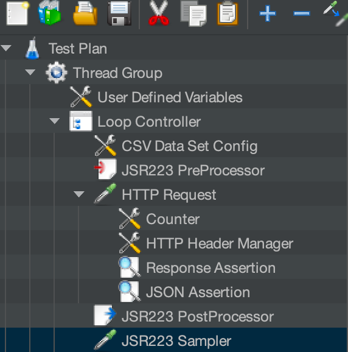

# Basic structure of a JMeter `Performance Test`

In this section, we get an overview of the used elements of JMeter for our Performance Test and see the basic structure.

## 1. Test plan

A [Test Plan](https://jmeter.apache.org/usermanual/build-test-plan.html) is a JMeter project. ([Definition from the user-manual](https://jmeter.apache.org/usermanual/component_reference.html#Test_Plan))

## 2. Thread Group

A [Thread Group](https://jmeter.apache.org/usermanual/component_reference.html#Thread_Group) can define a Group of Users with the same behavior. In our case, we will invoke only one HTTP endpoint.

## 3. Config Elements

The [`Config Elements`](https://jmeter.apache.org/usermanual/component_reference.html#config_elements) up defaults and variables for the usage of `Sampler` in our `HTTP Request`.

### 3.1. User Defined Variables 

We will use the [`User Defined Variables`](https://jmeter.apache.org/usermanual/component_reference.html#User_Defined_Variables) later and use them in combination with [User Parameters](https://jmeter.apache.org/usermanual/component_reference.html#User_ParametersIt). It is essential to understand that User Variables are only available in the hierarchy structure level of `Test Plan`, and Parameters are available in the entire `Test Plan`.

### 3.2. Counter 

We use the [`Counter`](https://jmeter.apache.org/usermanual/component_reference.html#Counter) in a loop to access the current loop count.

### 3.3. CSV Data Set Config

We use the [CSV Data Set Config](https://jmeter.apache.org/usermanual/component_reference.html#CSV_Data_Set_Config) to add the CSV file input to the `Loop Controller` for various invocation variations for the `HTTP request` payload.

### 3.4. Header Manager

We use the [`Header Manager`](https://jmeter.apache.org/usermanual/component_reference.html#HTTP_Header_Manager) to add the Header `Basic Authentication` to our `HTTP request` later.

## 4. Logic Controllers` and Loop Controller

The [`Logic Controllers`](https://jmeter.apache.org/usermanual/component_reference.html#logic_controllers) contains the [`Loop Controller`](https://jmeter.apache.org/usermanual/component_reference.html#Loop_Controller) we going to use to loop the CSV file input for various invocations of the `HTTP request` payload.

## 5. Samplers

[Samplers](https://jmeter.apache.org/usermanual/test_plan.html#samplers) are used to create requests and wait for responses.

### 5.1 `HTTP Request`

A [`HTTP Request`](https://jmeter.apache.org/usermanual/component_reference.html#HTTP_Request) is a part of a [Sampler](https://jmeter.apache.org/usermanual/component_reference.html#samplers).

We use the [`HTTP Request`](https://jmeter.apache.org/usermanual/component_reference.html#HTTP_Request) to create test results.

### 5.2 `JSR223_Sampler`

The [`JSR223_Sampler`](https://jmeter.apache.org/usermanual/component_reference.html#JSR223_Sampler) can be used to set properties or variables. In the example, we use it to create our own CSV file.

## 6. Assertions, Response Assertion, and JSON Assertion

The [Assertions](https://jmeter.apache.org/usermanual/component_reference.html#assertions) contain the verification points we can define to inspect the response and the response values in our case in a JSON format.

* [`Response Assertion`](https://jmeter.apache.org/usermanual/component_reference.html#Response_Assertion)
* [`JSON Assertion`](https://jmeter.apache.org/usermanual/component_reference.html#JSON_Assertion)

## 7. Pre Processors and JSR223 PreProcessor

We use the [`Pre Processors`](https://jmeter.apache.org/usermanual/component_reference.html#preprocessors) to modify the `Samplers` in our case, for example, to prepare the HTTP basic authentication.
In our case, we use the [`JSR223 PreProcessor`](https://jmeter.apache.org/usermanual/component_reference.html#JSR223_PreProcessor) with [`groovy`](https://groovy-lang.org/) scripting to implement a custom behavior.

## 8. Post Processors and JSR223 PreProcessor

We use the [`Post Processors`](https://jmeter.apache.org/usermanual/component_reference.html#postprocessors)  to modify information after the execution of a `Samplers` in our case. For example, we write a custom log in addition to the logs of JMeter. Therefore, we use the [`JSR223 PostProcessor`](https://jmeter.apache.org/usermanual/component_reference.html#JSR223_PostProcessor).