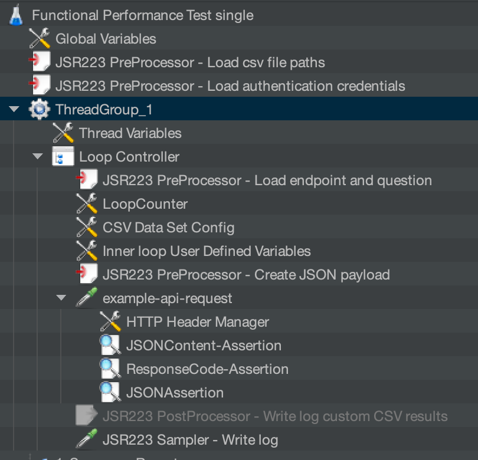

# Example Functional Performance Test

This is an example and contains many potentials for optimization, so feel free to optimize it to your need and use it as a starting point.
Below is the high-level table of content overview in this section.

1. Test Objectives
2. The `System Under Test`
3. The JMeter Test Plan
4. Test Execution

## 1. Test Objectives

We want to measure the `response time` for a REST Endpoint invocation for one `User` and verify and log the return JSON value content. We are saving additional logging of the response information in an additional CSV file.

We invoke one REST endpoint for the test, protected with base authentication.

Currently, concurrent users aren't in focus, and the [`System Under Test (SUT)`](https://glossary.istqb.org/en_US/term/system-under-test-2-1) the [`JMeter`](https://jmeter.apache.org/) performance test tool is running on the same local machine.  

## 2. The `System Under Test`

The `System Under Test` is based on the example you can find in the blog post [`Open the door wide open for Watson Assistant with "custom extensions" – an awesome progression`](https://suedbroecker.net/2022/11/16/open-the-door-into-the-wide-open-for-watson-assistant-with-custom-extensions-an-awesome-progression/) and the application can also run on `IBM Cloud Code Engine`.

To run the example application locally, follow these steps:

1. Clone the project to your local computer

```sh
git clone https://github.com/thomassuedbroecker/extension-apis.git
```

2. Follow the steps in this[ Run the Node.js application locally](https://github.com/thomassuedbroecker/extension-apis/blob/main/documentation/nodejs-application-development.md#1-run-nodejs-application-locally).

The gif below shows a [Postman](https://www.postman.com) invocation of the endpoint we will invoke from our `HTTP Sampler` in the `JMeter` `Test Plan`.


## 3. The `JMeter` Test Plan

### 3.1 Outline of the Test Plan

The following image contains the outline of the `Test Plan`.



### 3.2 Basic configuration

The following bullet points show the basic configuration for the Test Plan of our `Example Functional Performance Test`:

* 1 `Thread Group`
* 1 `User` 
* 1 `HTTP Request`


### 3.3 Application access configuration

We will load the credentials to access the application with the `Basic Authentication` from **environment variables**.
We also load the endpoint and the API path we need later for our `REST Endpoint` invocation.

```sh
export _USERNAME="admin"
export _PASSWORD="admin"
export _ENDPOINT=localhost
export _API_PATH=/v1/query
export _PROTOCOL=http
export _PORT=3000
export _QUESTIONS_CSV_PATH=$(pwd)/question_list.csv
```

### 3.4 Provide the data to loop the REST endpoint invocation and save the results

We will load all questions for an `User` to send in the request based on the CSV file content, and then we create a `log file` in a CSV format that contains the following information:

* Input format for the questions:

```sh
question
Can you help me?
```

* CSV log format:
  * Loop count
  * Status
  * Question
  * Answer

```sh
"1","200","success","Can you help me?","Yes, I can help you."
```

To use the CSV input, you must ensure that you configure the CSV file input in the JMeter UI. The following GIF shows how this works.


### 3.5 Pre and post-processing code

We use the [Groovy](https://groovy-lang.org/) programming language to implement the custom pre and post-processing in the example Test Plan.

#### 3.5.1 Load endpoint configuration (pre-processing)

The following code shows how we load the `endpoint` and `API path`  in our `HTTP Request`. Later, we will save these values in custom `thread variables` and save them as `properties` to make them available in the entire Test Plan.

Using the properties:

* Endpoint: `${__P(endpoint)}`
* API path: `${__P(api_path)`
* Port: `${__P(port)}`
* Protocol: `${__P(protocol)`

The image below shows where the variables are used in the `HTTP Sampler`.


* The following code is in the `JSR223 PreProcessor - Load endpoint and question`:

```groovy
log.info("******************************************")
log.info("** 3.Load environment configuration ******")
log.info("******************************************")

String endpoint_env = System.getenv("_ENDPOINT");
String api_path_env = System.getenv("_API_PATH");
String port_env = System.getenv("_PORT");
String protocol_env = System.getenv("_PROTOCOL");

vars.put("endpoint", endpoint_env );
vars.put("api_path", api_path_env );
props.put("endpoint",endpoint_env);
props.put("api_path",api_path_env);
vars.put("port", port_env );
props.put("port", port_env);
vars.put("protocol", protocol_env );
props.put("protocol", protocol_env);

String endpoint= vars.get('endpoint')
String api_path= vars.get('api_path')
String port= vars.get('port')
String protocol= vars.get('protocol')

log.info("*** Show local variables values")
log.info(endpoint)
log.info(api_path)
log.info(port)
log.info(protocol)
```

#### 3.5.2 Create JSON payload (pre-processing)

The following code shows how to create the JSON payload for the `HTTP request` using the values from the CSV file, and we save it in the `inner-loop Uer Defined Variables` to make so it is only available in in the `inner-loop`.

Using the variable:

* JSON payload: `${json_payload}`

The image below show how to use the variable in the `HTTP Sampler`.


* Code of the `JSR223 PreProcessor - Create JSON payload`

The following code creates the JSON payload before we invoke the  HTTP request.

```groovy
log.info("*******************************************")
log.info("***** 4. Create payload for the request ***")
log.info("*******************************************")
String question = vars.get('question')
props.put('question: ',question)
log.info("Question" + question)

String json_payload = "{\"query\":\"text:" + question + "\"}";
vars.put("json_payload",json_payload);
log.info("*** json payload ******")
log.info(json_payload)
```

#### 3.5.3 Load authentication information (pre-processing)

This code shows how we will load the information from the environment variables, save the values in custom in `thread variables`, and save them as properties to make them available in the entire Test Plan.

We also do the `base64` encoding for `USER:PASSWORD` to provide this to the basic authentication in the `HTTP Header Manager`.

Using the property: `Basic ${__P(auth_encoded)}` 


* Code in the `JSR223 PreProcessor - Load endpoint and question`.

```groovy
log.info("*******************************************")
log.info("*** 2. Load environment configuration ******")
log.info("*******************************************")

String username_env = System.getenv("_USERNAME")
String password_env = System.getenv("_PASSWORD")

log.info("*** Set JMeter variables")
vars.put("username", username_env )
vars.put("password", password_env)

String username = vars.get('username')
String password = vars.get('password')
log.info("*** Show local variables values")
log.info(username)
log.info(password)

log.info("*** Create base64 encoding")
def auth = username + ":" + password
auth_encoded = auth.bytes.encodeBase64().toString()
vars.put("auth_encoded",auth_encoded);
props.put("auth_encoded",auth_encoded);
log.info("*** Show encoding result")
log.info(auth)
log.info(auth_encoded)
```

### 3.6 Sampler code

We use the `JSR223 sampler` code with Groovy.

#### 3.6.1 Using a `JSR223 sampler` to create a custom log file in a CSV format

We save the CSV custom log file in the last element of our loop controller. The following images show the `JSR223 sampler`.


We create a custom log file in a CSV format in the following source code.

```sh
"2","200","success","Can you help me?","Yes, I can help you."
```

Therefore, we get the `loop counter` information, the exported variable name, to get the actual loop count.
* Loop count variable: `loop_counter`


```groovy
import groovy.json.*;
import groovy.csv.*;
import java.nio.file.Files;
import java.nio.file.Paths;

log.info("*************************************")
log.info("***** 7. Write custom CSV file ******")
log.info("*************************************")

// Don't include sampler result
SampleResult.setIgnore();

// values properies
String loop_counter = vars.get('loop_counter')
String question = vars.get('question')
String answer = ""
String response_type = ""
String responsecode = prev.getResponseCode();
String results_csv_path = props.get('results_csv_path');
String message = "";

if (responsecode == "200") {
	def response = prev.getResponseDataAsString();  
	def json_response = new JsonSlurper().parseText(response);
     String document_retrieval_strategy = json_response.retrievalDetails.document_retrieval_strategy;
     
	if (document_retrieval_strategy.equals("llm")) {
		  answer = json_response.results[0].text[0];	
	} else {				
	       message = "responsecode:\n" + responsecode + "\nquestion:\n" + question + "\nfull json response: \n" + json_response
	       answer = message;
	}
} else {
	message = "responsecode:\n" + responsecode + "\nquestion:\n" + question + "\n doesn't work";
	answer = message;
	log.info("error")
}

log.info(results_csv_path)
log.info(loop_counter)
log.info(question)
log.info(answer)
log.info(responsecode)

answer = answer.replaceAll("\"","'");
question = question.replaceAll("\"","'");

FileWriter fstream = new FileWriter(results_csv_path ,true);
BufferedWriter out = new BufferedWriter(fstream);

String w_question = '"' + question + '"'
String w_answer = '"' + answer + '"'
String w_loop_counter = '"' + loop_counter + '"'
String w_responsecode = '"' + responsecode + '"'

out.write(w_loop_counter);
out.write(",");
out.write(w_responsecode);
out.write(",");
out.write(w_question);
out.write(",");
out.write(w_answer);
out.newLine();
out.flush();

// Set SampleResult
SampleResult.setResponseData("Logfile creation in sampler: Values are written to CSV file: " + results_csv_path);
SampleResult.sampleEnd();
SampleResult.setResponseCode("200");
```

### 3.7 Assertion

#### 3.7.1 JSON Content Assertion

We use the following code to extract information from the given `JSON` response format.

* JSON format

```json
{
    "matching_results": 1,
    "retrievalDetails": {
      "document_retrieval_strategy": "llm"
    },
    "results": [
      {
        "document_id": "XYZ",
        "title": "Answer",
        "text": [
          "IBM has acquired Red Hat for $34 billion in October 2018."
        ],
        "link": null,
        "document_passages": null
      },
      {
        "document_id": "XYZ",
        "title": "IBM acquires Red Hat",
        "text": [
          "It's official - IBM has acquired Red Hat! The deal was announced in October 2018. IBM Closes Landmark Acquisition of Red Hat."
        ],
        "link": "https://www.ibm.com/support/pages/ibm-acquires-red-hat",
        "document_passages": [
          {
            "passage_text": "<em>IBM</em> <em>acquires</em> <em>Red</em> <em>Hat</em>",
            "passageAnswers": [
              {
                "answer_text": "IBM acquires Red Hat",
                "confidence": 0.07588528
              }
            ]
          }
        ]
      }
    ]
  }
```

* Source code

```sh
import groovy.json.*;

log.info("**********************************")
log.info("***** 5. JSONContent-Assertion ***")
log.info("**********************************")

String responsecode = prev.getResponseCode();
props.put('responsecode',responsecode)

def response = prev.getResponseDataAsString();  
def json_response = new JsonSlurper().parseText(response);
String document_retrieval_strategy = json_response.retrievalDetails.document_retrieval_strategy;
String assertion_name = "document_retrieval_strategy";
String message = "";
boolean verfication = false;

if (document_retrieval_strategy.equals("llm") && (responsecode == "200")){
	verfication = false;
	AssertionResult.setError(verfication);
	AssertionResult.setFailure(verfication);
	log.info("success")
	String answer = json_response.results[0].text[0];
     props.put('answer',answer)
     props.put('status','success')
} else {
	verfication = true;
	String question = vars.get('question')
	message = "responsecode:\n" + responsecode + "\nquestion:\n" + question + "\nfull json response: \n" + json_response;
	AssertionResult.setFailureMessage(message);
	AssertionResult.setFailure(verfication);
	AssertionResult.setError(verfication)
	log.info("error")
	String answer = message;
  props.put('answer',answer)
  props.put('status','failed')
}
```

## 4. Test Execution

### Step 1: Verify the installation

```sh
jmeter --version
```

Configure properties:

```sh
export VERSION=5.6.2
cd /usr/local/Cellar/jmeter/${VERSION}/libexec/bin/
ls
```

* Open the [properties file](example-user-properties-file-jmeter.properties/) and save the values your properties file.

```sh
nano user.properties
```

### Step 2: Define the bash automation configuration with environment variables

Create an environment variable file.

```sh
cat env_template > .env
```

Format:

```sh
export _USERNAME="admin"
export _PASSWORD="admin"
export _ENDPOINT=localhost
export _API_PATH=/v1/query
export _PROTOCOL=http
export _PORT=3000
export _QUESTIONS_CSV_PATH=$(pwd)/question_list.csv
```

### Step 3: Start JMeter to edit the performance test

```sh
source .env
jmeter
```

* Output:

```sh
WARNING: package sun.awt.X11 not in java.desktop
...
================================================================================
Don't use GUI mode for load testing !, only for Test creation and Test debugging.
For load testing, use CLI Mode (was NON GUI):
   jmeter -n -t [jmx file] -l [results file] -e -o [Path to web report folder]
& increase Java Heap to meet your test requirements:
   Modify current env variable HEAP="-Xms1g -Xmx1g -XX:MaxMetaspaceSize=256m" in the jmeter batch file
Check : https://jmeter.apache.org/usermanual/best-practices.html
================================================================================
```

* Open the Test Plan `performance-single.jmx` file and inspect the `test plan`


### Step 5: Start the JMeter performance test from the command line

It is usual to integrate test automation in many scenarios and this is the reason why I also create a bash auto
action example that can be integrated in many scenarios.

This bash automation does the following tasks:

  * It replaces the `user.properties` configuration for naming the HTML report.
  * It creates a folder with the `current timestamp prefix` and saves the HTML report in this folder.
  * It defines the name for the test result file using the same `current timestamp prefix`.
  * It defines the name for the custom CSV log file using the same `current timestamp prefix`.
  * It starts JMeter in the command line mode 

1. Command to start:

```sh
sh start_performance_test.sh
```
2. Example output:

```sh
************************************
         JMeter performance test
************************************
JMeter: Change configuration

JMeter: Start test
WARNING: package sun.awt.X11 not in java.desktop
...
Creating summariser <summary>
Created the tree successfully using performance-single.jmx
Starting standalone test @ 2023 Oct 21 16:35:30 CEST (1697898930577)
Waiting for possible Shutdown/StopTestNow/HeapDump/ThreadDump message on port 4445
summary +      1 in 00:00:01 =    1.0/s Avg:    26 Min:    26 Max:    26 Err:     0 (0.00%) Active: 1 Started: 1 Finished: 0
summary +      1 in 00:00:00 =    9.1/s Avg:     2 Min:     2 Max:     2 Err:     0 (0.00%) Active: 0 Started: 1 Finished: 1
summary =      2 in 00:00:01 =    1.8/s Avg:    14 Min:     2 Max:    26 Err:     0 (0.00%)
Tidying up ...    @ 2023 Oct 21 16:35:32 CEST (1697898932001)
... end of run
JMeter: open results
```

3. The results in the `HTML report`


4. Source code of the bash automation:

```sh
#!/bin/bash

source ./.env

export TESTPLAN="performance-single.jmx"
export TEST_DATE="$(date +'%F_%H_%M_%S')"
export TEST_RESULTS="${TEST_DATE}_test_results.csv"

export RESULTS_HOME="./results"
export _RESULTS_CSV_PATH="$(pwd)/results/${PATH_TO_HTML_RESULTS}/${TEST_DATE}_custom_test_results.csv"

export PATH_TO_HTML_RESULTS="${TEST_DATE}_html_results_performace_test"
export JMETER_PROPERTIES_BACKUP="./user_backup.properties"
export JMETER_CUSTOM_PROPERTIES="./example-user-properties-file-jmeter.properties"
export JMETER_PROPERTIES="/usr/local/Cellar/jmeter/5.6.2/libexec/bin/user.properties"

mkdir ${RESULTS_HOME}/${PATH_TO_HTML_RESULTS}

echo "************************************"
echo "         JMeter performance test"
echo "************************************"

echo "JMeter: Change configuration"
cat ${JMETER_PROPERTIES} > ${JMETER_PROPERTIES_BACKUP}
cat ${JMETER_CUSTOM_PROPERTIES} > ${JMETER_PROPERTIES}
#cat  ${JMETER_PROPERTIES}
echo ""
echo "JMeter: Start test"
jmeter -n -t ${TESTPLAN} -l ${RESULTS_HOME}/${TEST_RESULTS} -e -o ${RESULTS_HOME}/${PATH_TO_HTML_RESULTS}
echo "JMeter: open results"
open ${RESULTS_HOME}/${PATH_TO_HTML_RESULTS}/index.html
```
